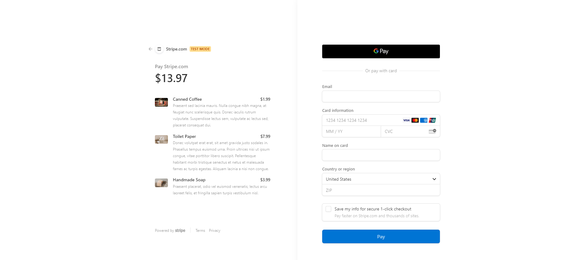

# redux-store-refactor

# Table of Content
[Description](#Description)

[Installation](#Installation)

[Usage](#Usage)

[License](#License)

[Contact](#Contact)

## Description
Refactor to redux

## Installation
Run 'npm install' in your terminal

## Usage
Use the provided Heroku link above to go to the website.

## License

## Contact
https://github.com/mnguyen14

Email: matthewnguyen0814@gmail.com