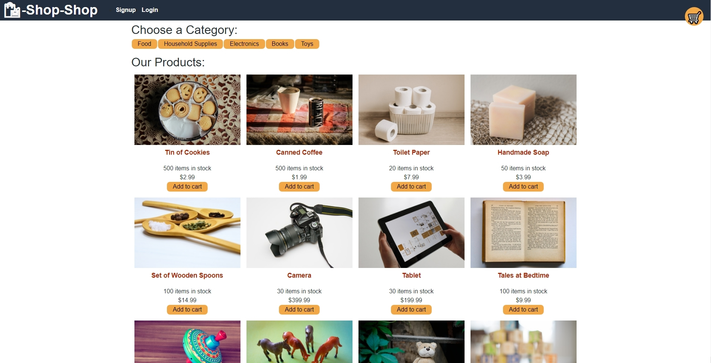

# redux-store-refactor

Link to live deployed app:

https://tranquil-river-60853.herokuapp.com/

# Table of Content
[Description](#Description)

[Installation](#Installation)

[Usage](#Usage)

[License](#License)

[Contact](#Contact)

## Description
Refactor to redux

## Installation
Run 'npm install' in your terminal

## Usage
Use the provided Heroku link above to go to the website.

Upon opening the heroku link in your browser you will be greeted with this page. You can sign up on top to be logged in. Once logged in you can add items to your cart like so.

You can also delete items by clicking on the trash can icon and edit the quantity you want to buy by clicking the down or up arrow. The total will update automatically.

Once done adding the items you want from you cart, you can click on check out to be redirected to a checkout form.

## License

## Contact
https://github.com/mnguyen14

Email: matthewnguyen0814@gmail.com